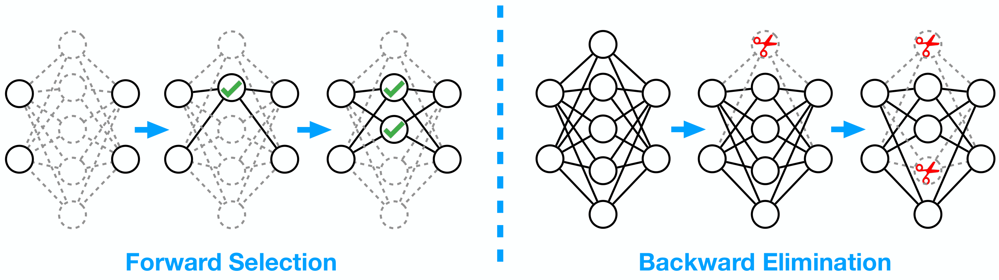
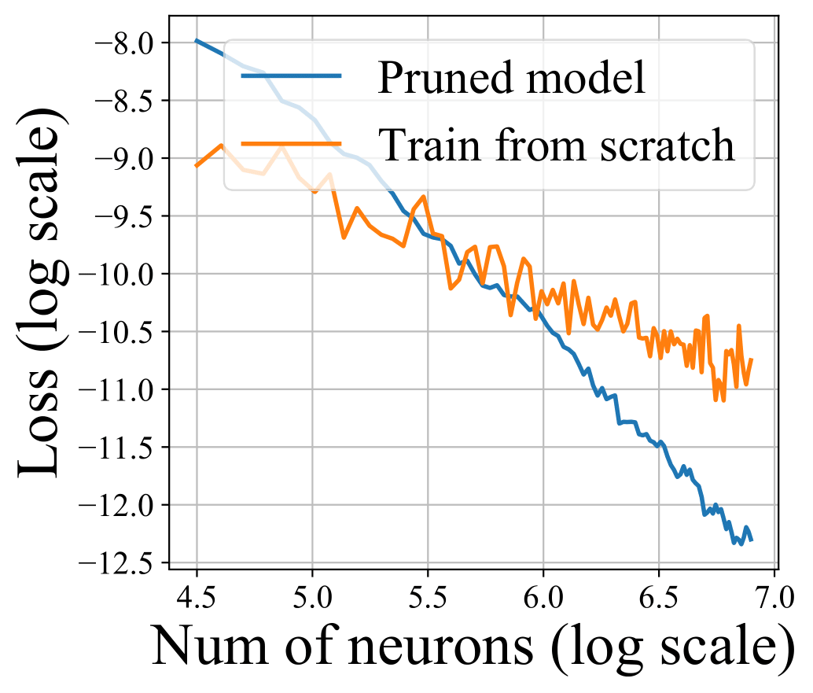

# Learning Winning Subnetworks via Greedy Optimization

Whether good subnetworks provably exist? How to find them efficiently? If network pruning can be provably better than direct training using gradient descent?

We answer these problems positively by proposing a simple greedy selection approach for finding good subnetworks, which starts from an empty network and greedily adds important neurons from the large network. This differs from the existing methods based on backward elimination, which remove redundant neurons from the large network.

### Related Publication

Mao Ye * , Lemeng Wu *  and Qiang Liu. Greedy Optimization Provably Wins the Lottery: Logarithmic Number of Winning Tickets is Enough. *NeurIPS 2020*

Mao Ye, Chengyue Gong * , Lizhen Nie * , Denny Zhou, Adam Klivans and Qiang Liu. [Good Subnetworks Provably Exists: Pruning via Greedy Forward Selection.](https://proceedings.icml.cc/static/paper_files/icml/2020/1781-Paper.pdf) *ICML 2020*

</img>

Theoretically, applying the greedy selection strategy on sufficiently large pre-trained networks guarantees to
find small subnetworks with lower loss than networks directly trained with gradient descent. Our
results also apply to pruning randomly weighted networks.

</img>

Our theory and empirical results on MobileNet suggest that we should fine-tune the pruned subnetworks to leverage the information from the large model, instead
of re-training from new random initialization.

## How to run

-- Download the pretrain model

-- Prune the network using mobile2_prune.py

-- Finetune the pruned model using mobile2_finetune.py

## Citation

    @article{ye2020good,
      title={Good Subnetworks Provably Exist: Pruning via Greedy Forward Selection},
      author={Ye, Mao and Gong, Chengyue and Nie, Lizhen and Zhou, Denny and Klivans, Adam and Liu, Qiang},
      journal={arXiv preprint arXiv:2003.01794},
      year={2020}
    }

## Acknowledgements
We use the pretrain Mobilenet_V2 (Top1 acc: 72.192) provided by
https://github.com/d-li14/mobilenetv2.pytorch
